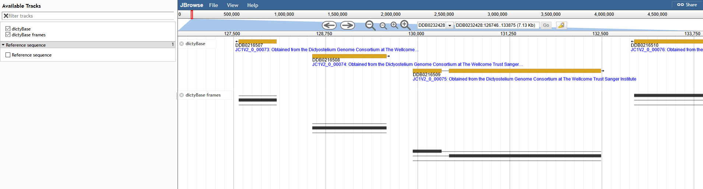

# frameviewer

A JBrowse plugin for viewing which reading frame a coding region is in

## Screenshot

Figure 1. Shows protein translations and reading frames for a gene

## Configuration

* style.frameHeight - the height of the feature that contains the frames. Default: 50px
* showProtein - show the protein sequence of coding regions on the glyph. Default: false
* showDNA - show the DNA of coding regions on the glyph. Default: false

## Example

    {
     "label" : "dictyBase frames",
     "urlTemplate" : "tracks/dictyBase/{refseq}/trackData.json",
     "storeClass" : "JBrowse/Store/SeqFeature/NCList",
     "type" : "FrameViewer/View/Track/Frames",
     "showProtein": true
    }

The test/data/ directory contains a sample config also.

## Installation

Download to plugins/FrameViewer and add

    "plugins": ["FrameViewer"]

to jbrowse_conf.json or trackList.json. See JBrowse FAQ on installing plugins for more details

## Feedback

Please let me know if you have feedback or know of crazy biology corner cases that need covering!
